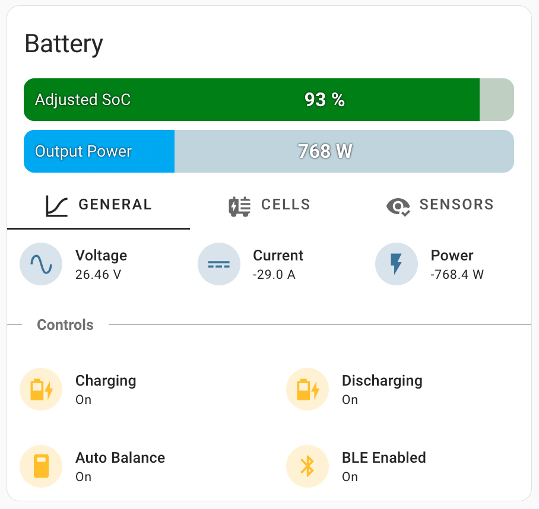
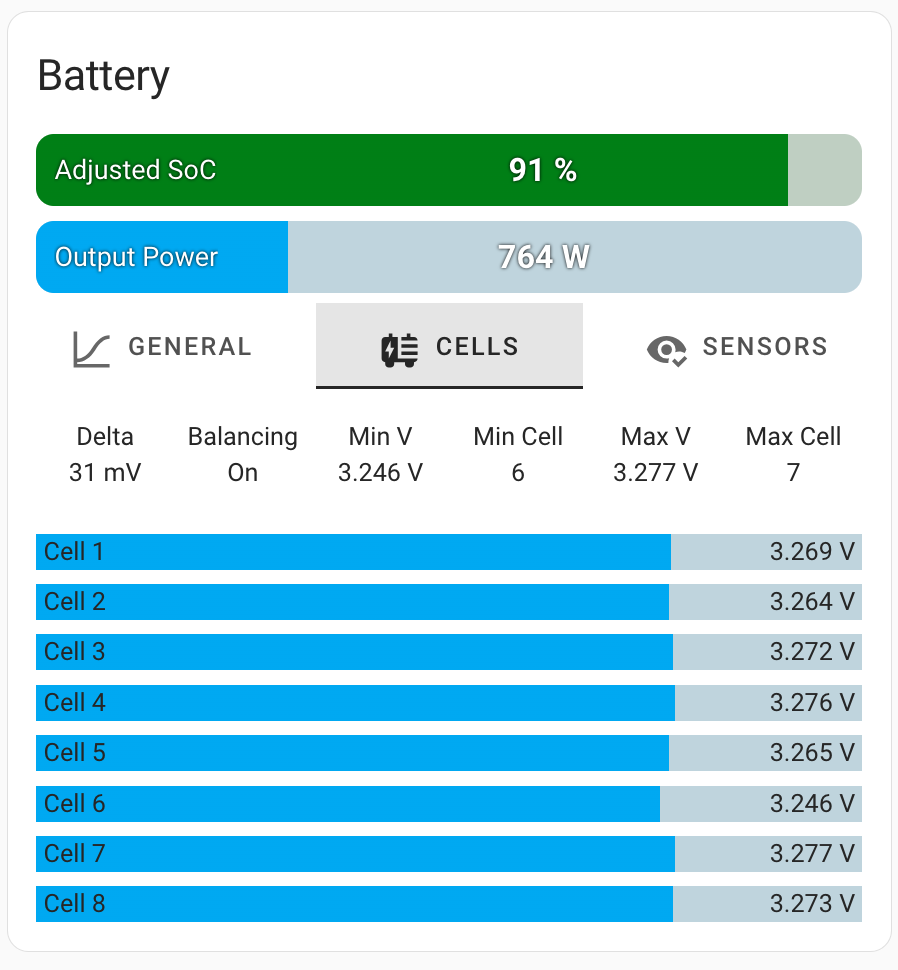
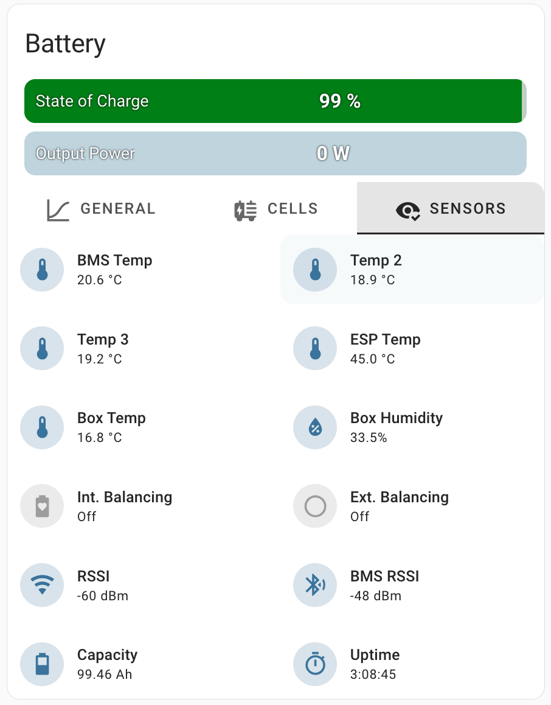

# esphome-smart-battery
Control DIY smart battery using JBD BMS, external balancer. Monitor it with environment sensors and display.


## Hardware
[Detailed hardware description](pcb/README.md)

## Software
1) Create new project subdirectory within your ESPHome configuration directory (let it be `smart-battery`, for example) 
2) Copy the contents of the `src` repo folder to a newly created project directory.
3) Now, the `main.yaml` file must be located under `<esphome_config>/smart-battery`
4) Create file `smart-battery.yaml` in the esphome config directory root and copy contents of [example config](/examples/smart-battery.yaml)
5) Edit substitutions & customize `smart-battery.yaml`. You can add contents of [common_system](/examples/common_system.yaml) & [common_sensors](/examples/common_sensors.yaml) to this file or include them separately following the example.
6) Flash firmware to your ESP32

## Battery card
For easy battery control in Home Assistant, you can use the [following snippet](/battery-card/battery-card-example.yaml). It compiles all the essential battery sensors and controls in a compact manner. The following custom plugins are used: [bar-card](https://github.com/custom-cards/bar-card), [stack-in-card](https://github.com/custom-cards/stack-in-card), [tabbed-card](https://github.com/kinghat/tabbed-card), [text-divider-row](https://github.com/iantrich/text-divider-row).
<div vertical-align="top">
    
    
    
</div>

## Adjusted SoC
ou can calculate the adjusted "State of Charge" value using the "calibrate_*" filters of ESPHome. To do this, edit the template sensor "Adjusted SoC" and provide your mapping for cell voltage values in the `smart-battery.yaml` config. This can be useful for setting a smoother charge/discharge curve or for optimizing the experience working with an inverter.
```
sensor:
  - platform: template
    name: "Adjusted SoC"
    unit_of_measurement: "%"
    accuracy_decimals: 0
    device_class: battery
    state_class: measurement
    update_interval: 10s
    lambda: |-
      return id(average_cell_voltage).state;
    filters:
      - calibrate_linear:
         method: exact
         datapoints:
          - 2.800 -> 0.0
          - 3.144 -> 10.0
          - 3.170 -> 20.0
          - 3.188 -> 30.0
          - 3.208 -> 40.0
          - 3.214 -> 50.0
          - 3.220 -> 60.0
          - 3.226 -> 70.0
          - 3.233 -> 80.0
          - 3.250 -> 90.0
          - 3.388 -> 100.0
          - 3.500 -> 100.0
      - clamp:
          min_value: 0
          max_value: 100
```
