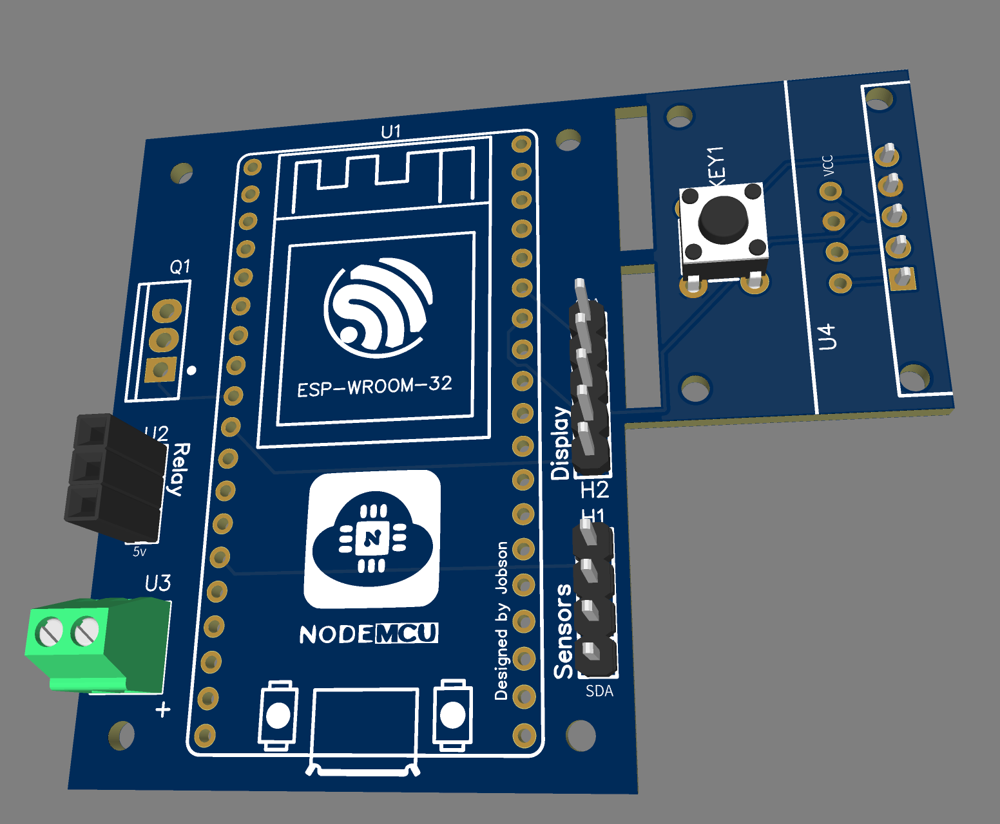

# esphome-smart-battery
Control DIY smart battery using JBD BMS, external balancer. Monitor it with environment sensors and display.

## Hardware
[Detailed hardware description](pcb/README.md)

## Software
1) Create new project subdirectory within your ESPHome configuration directory (let it be `smart-battery`, for example) 
2) Copy the contents of the `src` repo folder to a newly created project directory.
3) Now, the `main.yaml` file must be located under `<esphome_config>/smart-battery`
4) Create file `smart-battery.yaml` in the esphome config directory root and copy contents of [example config](/examples/smart-battery.yaml)
5) Edit substitutions & customize `smart-battery.yaml`. You can add contents of [common_system](/examples/common_system.yaml) & [common_sensors](/examples/common_sensors.yaml) to this file or include them separately following the example.
6) Flash firmware to your ESP32
