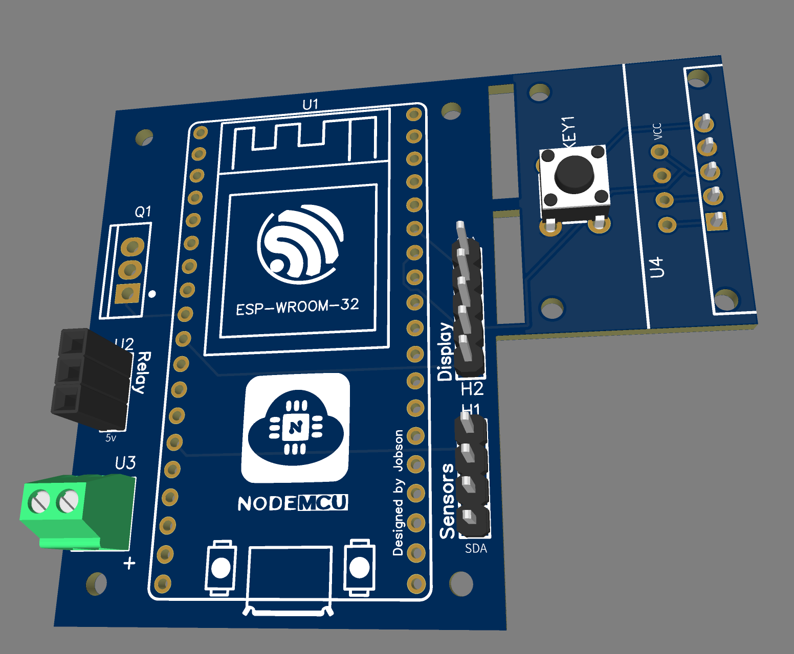
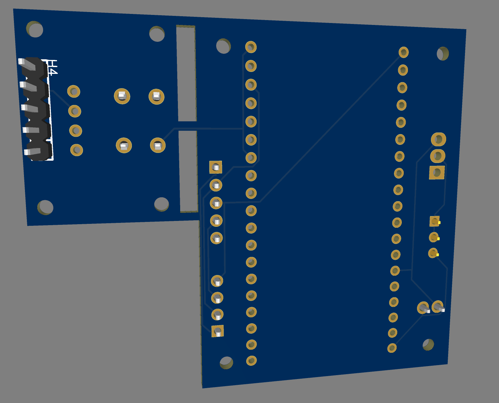

# ESPHome Smart Battery Hardware

OSHWLab Project: https://oshwlab.com/ganzevich/esphome-smart-battery

## Controller PCB:
- [Schematic](Schematic_ESPHome%20Smart%20Battery.pdf)
- [BOM](BOM_ESPHome%20Smart%20Battery.csv)
- [Gerber](Gerber_PCB_Smart%20Battery%20AIO.zip)
- [EasyEDA project backup](EasyEDA_Project_Backup.zip)
- [PCB Top View](pcb_top.png)
  
- [PCB Bottom View](pcb_bottom.png)
  

